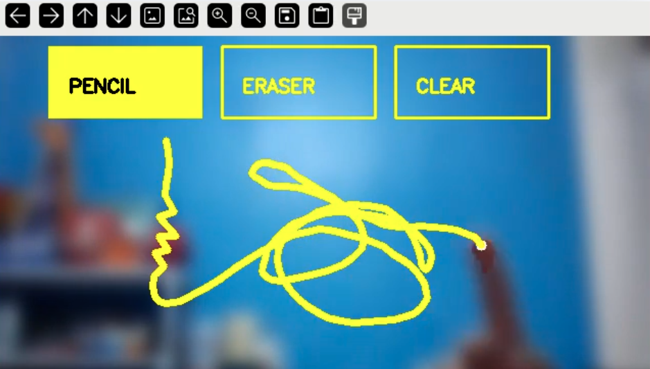

# Air Draw: Gesture-Controlled Canvas

A real-time Computer Vision application that allows you to draw on your screen using hand gestures. This project features background blurring for a professional look and a "hover-to-click" UI for a touchless experience.

##  Features

* **Virtual Ink:** Draw in mid-air using your index finger.
* **Background Segmentation:** Uses AI to blur your background while keeping you in focus.
* **Hover-to-Select UI:** Change tools (Pencil, Eraser, Clear) by hovering your finger over buttons—no mouse required.
* **Visual Feedback:** Dynamic progress rings indicate when a tool is being selected.
* **Automatic Setup:** Includes a shell script to handle environment creation and dependencies.

## Tech Stack

* **Python 3.10**
* **OpenCV:** Image processing and rendering.
* **MediaPipe:** Hand landmark tracking and selfie segmentation.
* **NumPy:** Canvas matrix manipulation.

## Prerequisites

* A webcam.
* Python 3.10 installed.
* A Bash-compatible terminal (Linux, macOS, or Git Bash on Windows).

## Installation & Launch

You can set up the entire environment and run the notebook with a single command:

1.  **Make the script executable:**
    ```bash
    chmod +x run.sh
    ```

2.  **Run the application:**
    ```bash
    ./run.sh
    ```

*This script creates a virtual environment (`env3.10`), installs `mediapipe`, `opencv-python`, and `notebook`, then launches the Jupyter interface.*

## How to Use

| Tool | Action |
| :--- | :--- |
| **Pencil** | Hover over "PENCIL" until the white ring fills. Draw with your index finger up. |
| **Eraser** | Hover over "ERASER". Move your finger over lines to remove them. |
| **Clear** | Hover over "CLEAR" to wipe the entire canvas instantly. |
| **Stop Drawing** | Fold your index finger or move it into the top menu area. |
| **Exit** | Press the **ESC** key to close the camera window. |

# Demo


## Project Structure

* `run.sh`: Automated environment setup and dependency installer.
* `air-draw.ipynb`: The core Python logic for hand tracking and the drawing engine.

---
